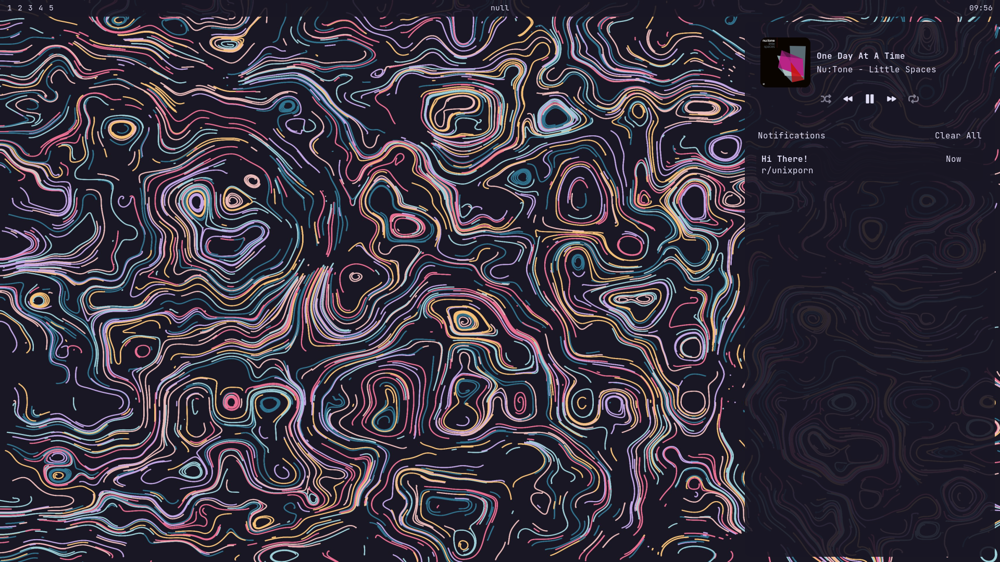
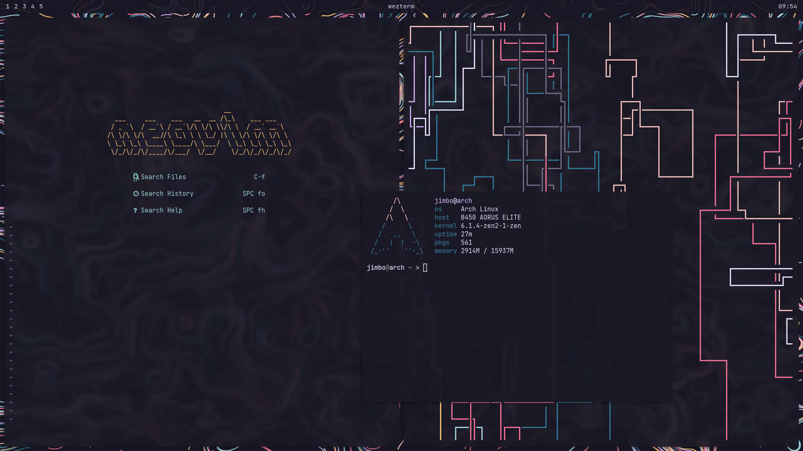
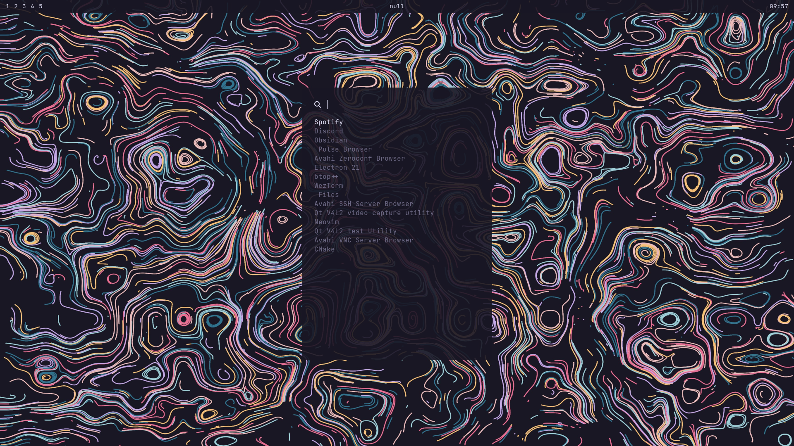

# dotfiles

# notice
This repository is not actively maintained. I've switched to GNOME for a more out-of-the-box experience.

## configurations
- **eww** - bar & widgets
- **hyprland** - tiling wayland compositor
- [**neovim**](https://github.com/jamezburritos/nvim-config) - editor/ide
- **starship** - cross-platform shell prompt
- **swaync** - wayland notification center
- **wezterm** - terminal emulator
- **wofi** - wayland app launcher
- **zsh** - cross-platform shell 

## screenshots

